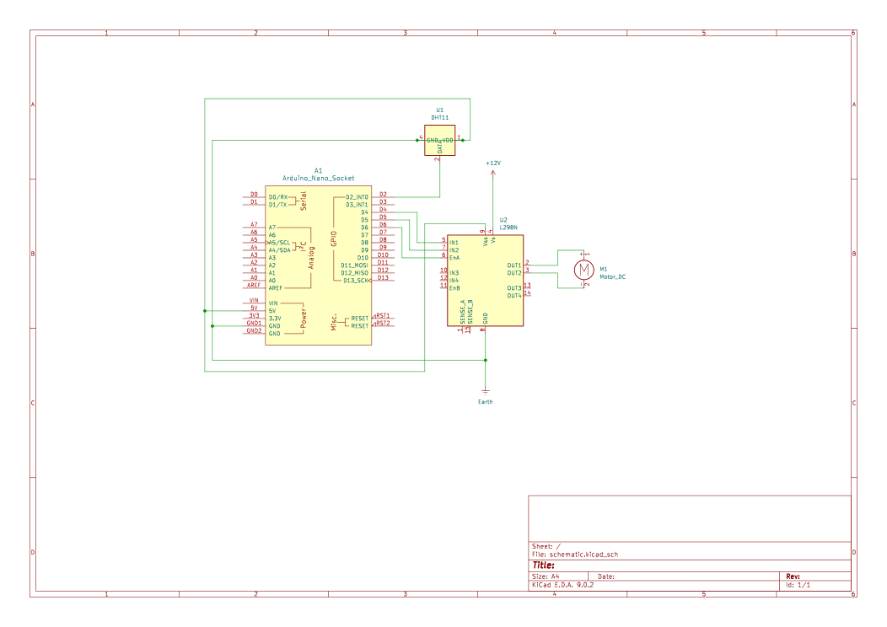

# Temperature Controller

This project is part of my instrumentation course in my university.

This project aimed to simulate a device that could control the output  temperature based on the temperature of the environment. It's ideal to utilize AC in this device, but due to lack of resource, we decide to use DC motor instead. The following is the schematic diagram of the device:

## Basic Functions

This device control the speed of DC motor based on the following temperature range:

- <25°C: 0 RPM
- <27°C: 282.35 RPM
- <30°C: 847.05 RPM
- >30°C: 1411.76 RPM

## Acknowledgements
Credit to my groupmates Ariff and Imanizar
